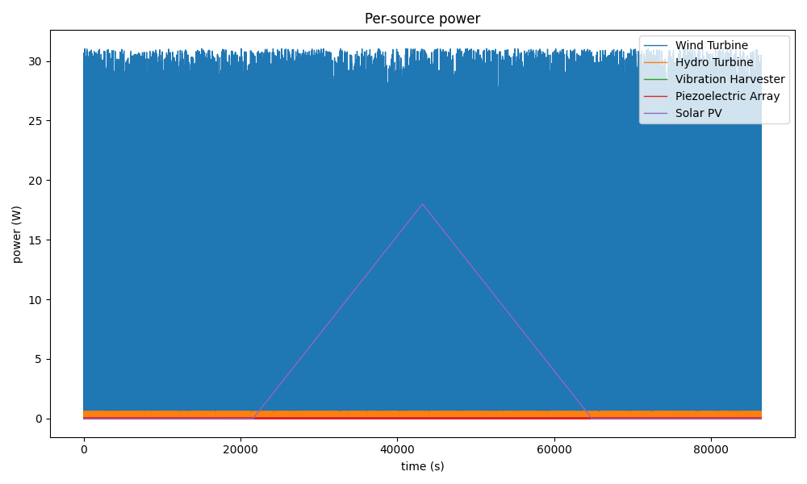
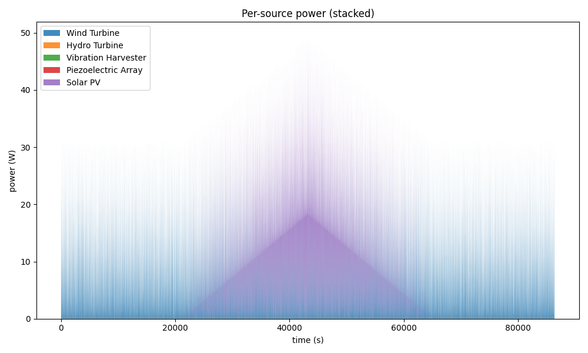
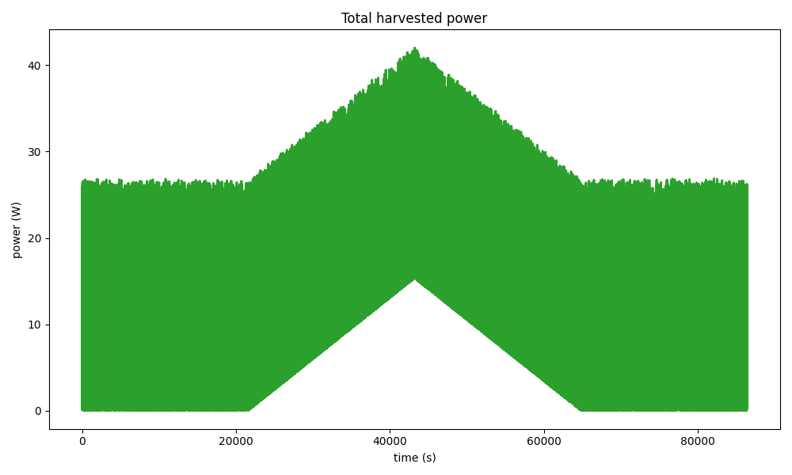
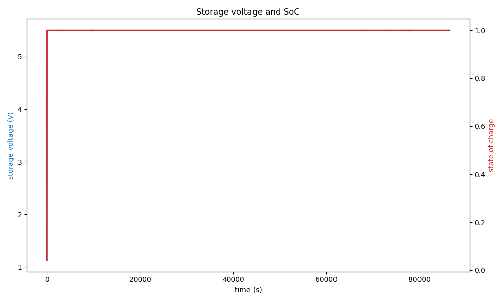
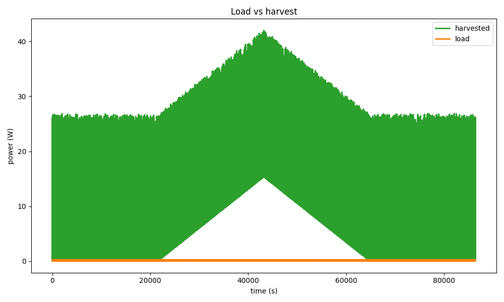
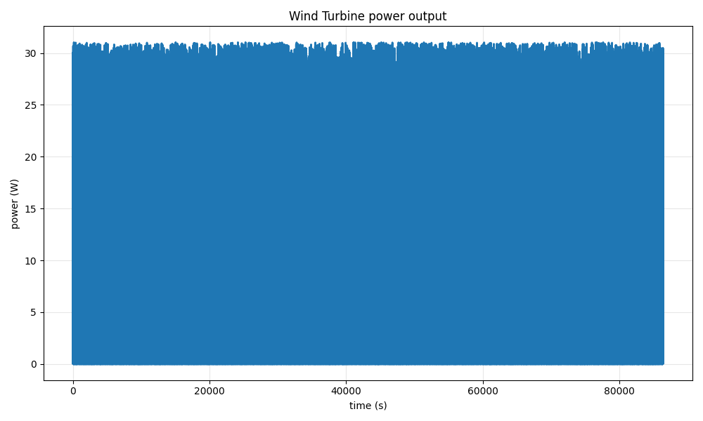
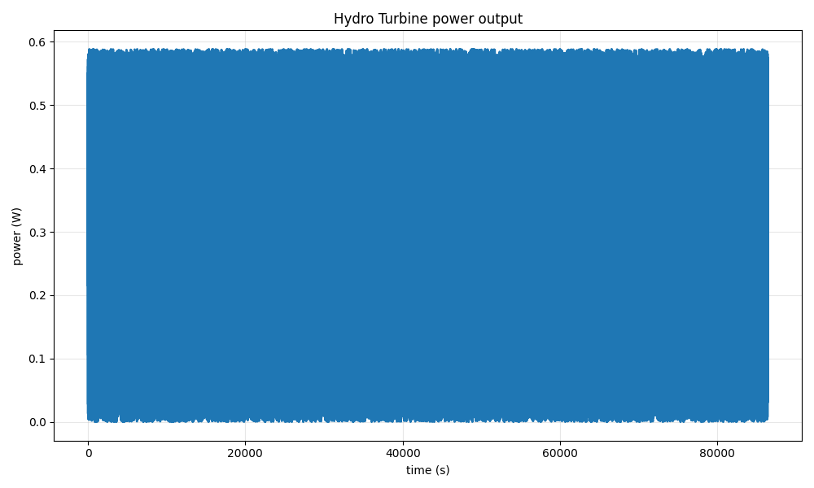
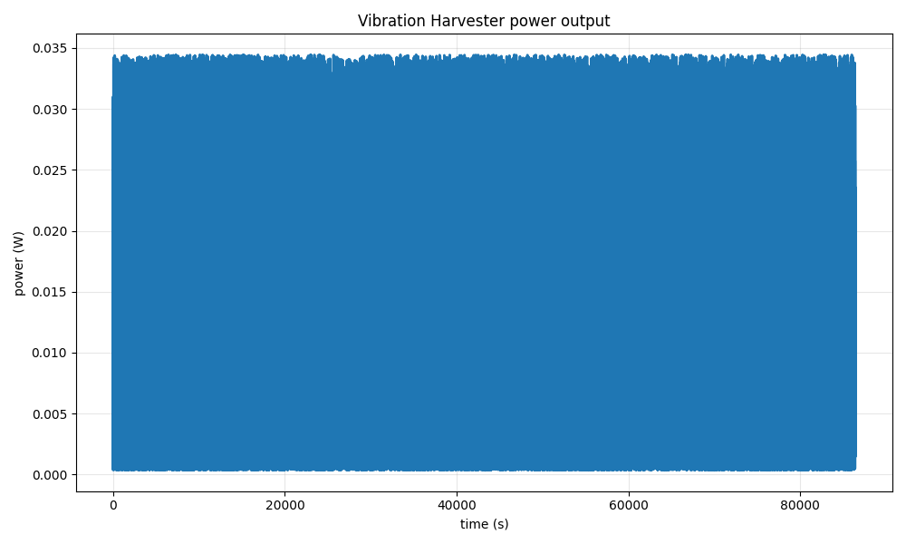
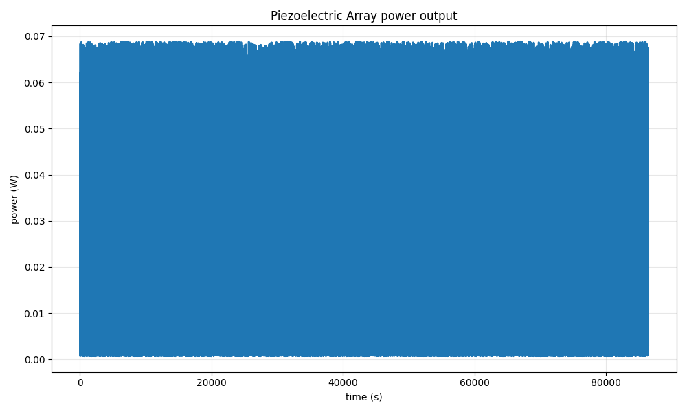
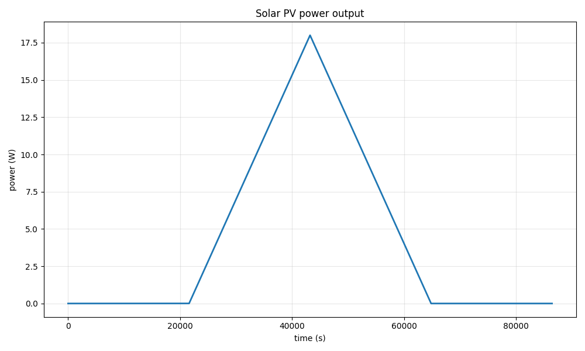

# HybridHarvest — Example Run

Generated by `scripts/generate_example_report.py` with HybridHarvest
v0.1.0. Everything below is reproducible from the command in the last
section.

## Run configuration

| Setting | Value |
|---|---|
| Duration | 24 hours (86,400 steps) |
| Timestep `dt` | 1.0 s |
| Random seed | 42 |
| Sources | wind, hydro, vibration, piezo, solar |
| Conversion efficiency | 0.85 |
| Storage | 10 F supercapacitor, clamped to 5.5 V |
| Checked-in CSV | every 60th sample (60 s resolution), to keep the repository small |

## Summary

| Metric | Value |
|---|---|
| Energy harvested (after conversion losses) | 256.22 Wh |
| Energy summed across sources (pre-conversion) | 301.44 Wh |
| Load consumed | 0.3680 Wh |
| Net energy | 255.86 Wh |
| Peak harvested power | 42.01 W |
| Mean harvested power | 10.6760 W |
| State of charge range | 0.042 – 1.000 |
| Storage voltage range | 1.128 – 5.500 V |

## Per-Source Contribution

| Source | Peak (W) | Mean (W) | Energy (Wh) | Share (%) |
|---|---|---|---|---|
| 🌬️ Wind Turbine | 31.0337 | 7.7274 | 185.4571 | 61.52 |
| 💧 Hydro Turbine | 0.5886 | 0.2943 | 7.0642 | 2.34 |
| 📳 Vibration Harvester | 0.0345 | 0.0128 | 0.3066 | 0.10 |
| ⚡ Piezoelectric Array | 0.0689 | 0.0255 | 0.6131 | 0.20 |
| ☀️ Solar PV | 18.0000 | 4.5000 | 108.0000 | 35.83 |
| **Total** | — | — | **301.4410** | **100.00** |

Shares are computed against the sum of all sources, so they add to 100 %.
The *Energy harvested* figure in the summary is lower because it is measured
after the 0.85 conversion efficiency; that difference is the conversion loss.

## Per-Category Data Files

The same run is also exported one category at a time, so each harvester has its
own time series and its own statistics file:

| Source | Time series | Statistics |
|---|---|---|
| 🌬️ Wind Turbine | `data/processed/wind/example_wind_24h.csv` | `data/processed/wind/stats_wind.json` |
| 💧 Hydro Turbine | `data/processed/hydro/example_hydro_24h.csv` | `data/processed/hydro/stats_hydro.json` |
| 📳 Vibration Harvester | `data/processed/vibration/example_vibration_24h.csv` | `data/processed/vibration/stats_vibration.json` |
| ⚡ Piezoelectric Array | `data/processed/piezo/example_piezo_24h.csv` | `data/processed/piezo/stats_piezo.json` |
| ☀️ Solar PV | `data/processed/solar/example_solar_24h.csv` | `data/processed/solar/stats_solar.json` |

Each CSV carries `time_s`, the source's own driving inputs, `power_W` and
`energy_Wh_cumulative`; each JSON holds the peak, mean, standard deviation,
total energy, share, operating hours and capacity factor, plus the
source-specific extras (`cut_in_hours` for wind, `efficiency` for piezo, and so
on). Regenerate them with:

```bash
python scripts/export_categorized_data.py
```

See [`data/README.md`](../data/README.md) for the full schema.

## Charts

Per-source power, one line per harvester:



Per-source power as a stacked area — total height is the raw harvest:



Total harvested power after conversion losses:



Storage voltage and state of charge:



Load versus harvest:



### Individual sources

| Wind | Hydro |
|---|---|
|  |  |

| Vibration | Piezo |
|---|---|
|  |  |

| Solar | |
|---|---|
|  | |

## Observations

- **Wind Turbine** is the largest contributor at
  61.52 % of the pre-conversion energy.
- The sources span a wide range of scale: the wind turbine peaks at
  31.03 W while the vibration harvester
  peaks at 0.0345 W. The stacked chart
  is therefore dominated by wind; the per-source charts above are the right
  place to read the smaller contributors.
- Storage state of charge varies between 0.042 and 1.000.
  The duty-cycled load draws only 0.3680 Wh over the whole day, roughly
  0.14 % of what is harvested.
- Solar follows the diurnal curve: zero before 06:00 and after 18:00, peaking
  at local noon.

## Reproduce

```bash
pip install -e ".[dev,ui]"
python scripts/generate_example_report.py
```
